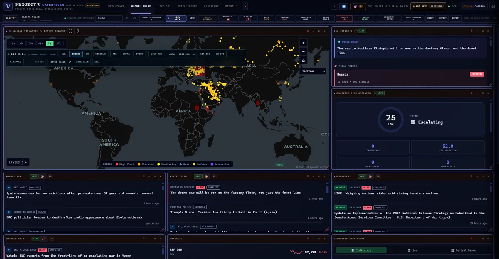
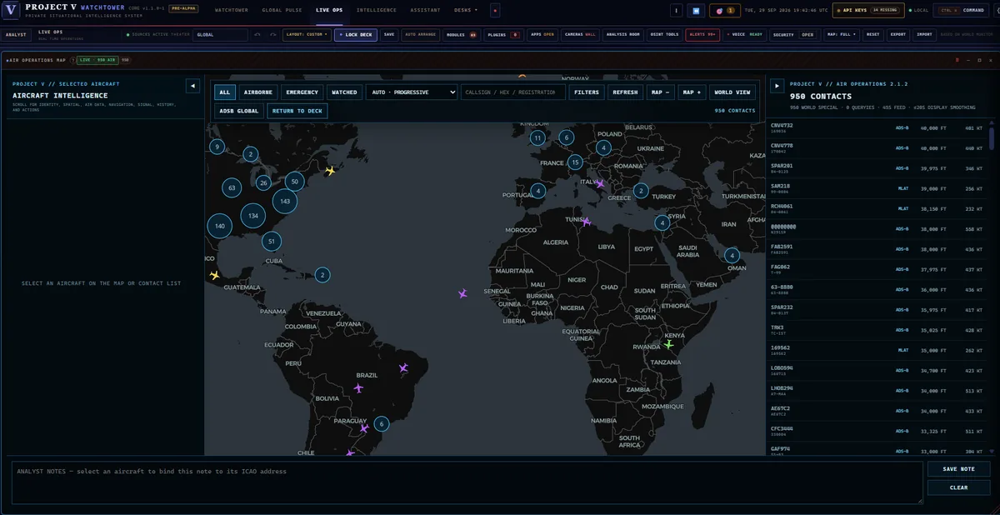
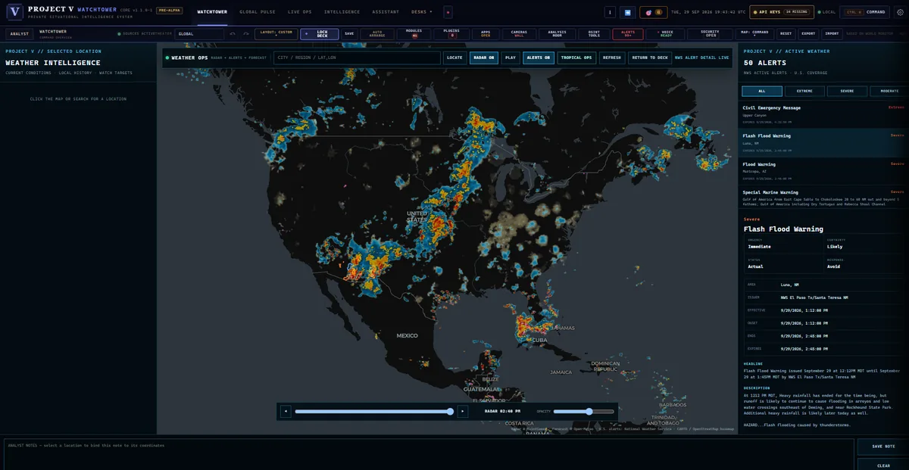
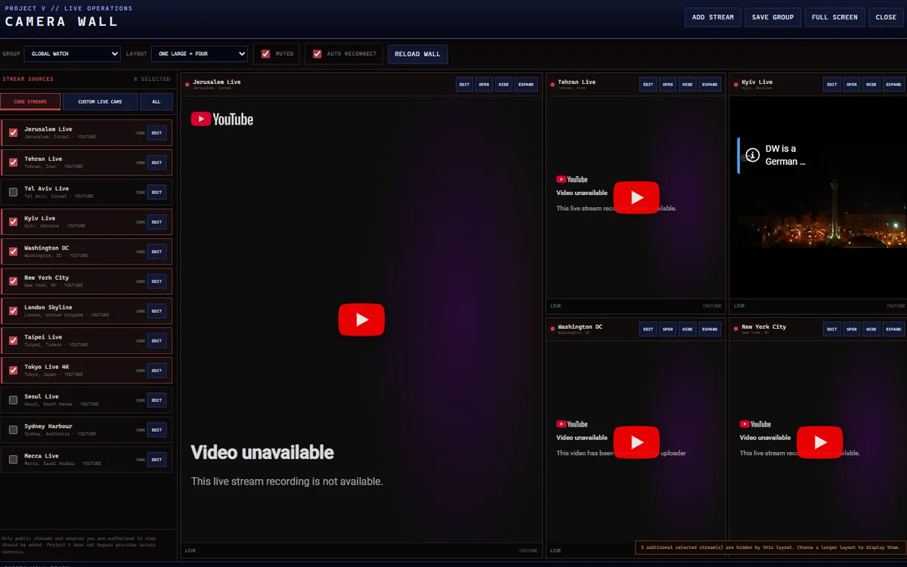
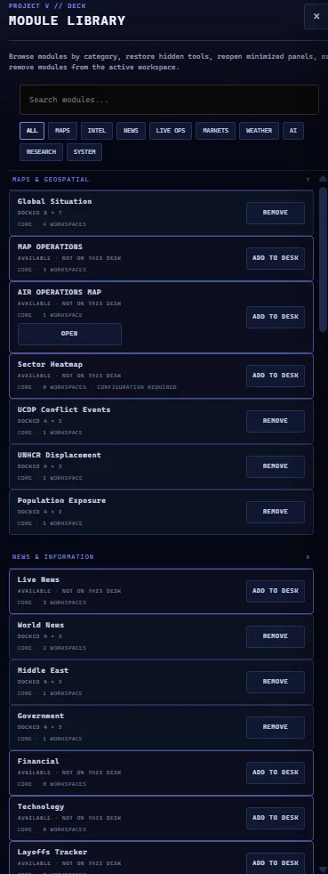
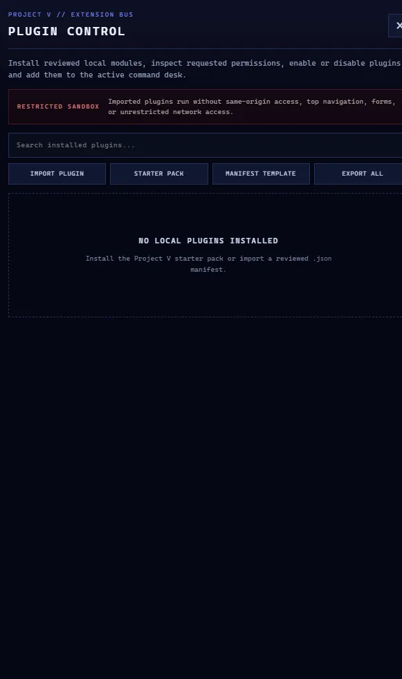

# Project V // Watchtower

**Local-first Windows situational awareness, research, mapping, monitoring, and optional local-AI analysis.**

[**Installation**](INSTALLATION.md) ·
[**White Paper**](WHITEPAPER.md) ·
[**Roadmap**](ROADMAP.md) ·
[**Security**](SECURITY.md) ·
[**Upstream & License**](UPSTREAM_AND_LICENSE.md)

  
   
  <strong>Global Pulse</strong> — live mapping, intelligence feeds, AI insights, strategic risk, markets, and operational panels in one command deck.

> [!NOTE]
> **Official fork.** This repository is the Project V // Watchtower fork of [World Monitor](https://github.com/koala73/worldmonitor). Watchtower is independently maintained, substantially modified, and is not an official World Monitor release or endorsed by the upstream developers.

## Repository transition

On **September 29, 2026**, Project V moved Watchtower onto a proper GitHub fork of World Monitor so the upstream relationship and source lineage are explicit.

The previous standalone Watchtower repository is preserved at:

**[ProjectVOfficial/Project-V-Watchtower-Legacy](https://github.com/ProjectVOfficial/Project-V-Watchtower-Legacy)**

That legacy repository retains the earlier Watchtower commit history, screenshots, tags, and 1.x release assets. New source development belongs in this fork.

See [docs/project-v/LEGACY_REPOSITORY.md](docs/project-v/LEGACY_REPOSITORY.md).

## Current status

This fork currently contains the full upstream World Monitor source plus the Project V documentation and release history migrated from the earlier standalone Watchtower repository.

Future Project V Watchtower source changes should be committed here on top of the upstream lineage. The legacy repository should be treated as a historical archive rather than the active development repository.

## Watchtower direction

Project V // Watchtower is a Windows desktop command center focused on combining live information, maps, alerts, research, cases, operational notes, public-source tools, and optional local analysis in one workspace.

Project V work has included or planned capabilities such as:

- customizable multi-workspace command decks
- live world mapping and situational-awareness panels
- aircraft, weather, fire, infrastructure, and other operational layers
- watchlists, alerts, timelines, and mission presets
- dedicated video / camera wall workflows
- research and case-management tools
- optional local AI and assistant workflows
- portable/local-first operation
- 2D/3D satellite-style mapping work
- Project V ecosystem integrations

See [WHITEPAPER.md](WHITEPAPER.md), [UPDATES.md](UPDATES.md), and [ROADMAP.md](ROADMAP.md) for Project V-specific documentation.

## Screenshots

### Live operations

<table>
  <tr>
    <td width="50%" valign="top">
      
       <strong>Air Operations</strong> — global ADS-B contacts, aircraft intelligence, filters, watch targets, and analyst notes.
    </td>
    <td width="50%" valign="top">
      
       <strong>Weather Intelligence</strong> — radar, active NWS alerts, location intelligence, and operational weather detail.
    </td>
  </tr>
</table>

### Monitoring and extensibility

  
   
  <strong>Camera Wall</strong> — configurable live-stream groups, multi-feed layouts, source management, and full-screen monitoring.

<table>
  <tr>
    <td width="50%" valign="top" align="center">
      
       <strong>Module Library</strong> — add, remove, restore, and organize operational modules across command desks.
    </td>
    <td width="50%" valign="top" align="center">
      
       <strong>Plugin Control</strong> — reviewed local extensions with permission-aware, restricted sandboxing.
    </td>
  </tr>
</table>

## Legacy Windows releases

Existing Watchtower **1.x** installers and portable builds remain available from the legacy repository's Releases page:

**[Legacy Watchtower Releases](https://github.com/ProjectVOfficial/Project-V-Watchtower-Legacy/releases)**

Those historical releases should not be confused with future builds produced from this fork.

## Local-first does not mean offline-only

Watchtower is designed around local workspaces and local control, but live maps, news, weather, aviation, public-source research, and other feeds may use external network services.

Optional AI may be local or externally connected depending on configuration.

See [PRIVACY.md](PRIVACY.md) and [docs/DATA_AND_AI.md](docs/DATA_AND_AI.md).

## Upstream and license

The upstream World Monitor repository currently licenses its source code under **AGPL-3.0-only**.

Project V does not claim ownership of upstream World Monitor code. Upstream authors retain copyright in their contributions, and Project V contributors retain copyright in original Project V contributions subject to the AGPL terms governing the combined covered work.

The upstream license text in [LICENSE](LICENSE) is intentionally retained.

See [NOTICE.md](NOTICE.md) and [UPSTREAM_AND_LICENSE.md](UPSTREAM_AND_LICENSE.md).

## Corresponding source

Future Watchtower binary releases produced from this repository should identify the exact source revision/tag used to build them and provide corresponding source as required by AGPL-3.0-only.

Historical 1.x binaries remain paired with their historical source materials in the legacy repository.

## Security

Watchtower has not been independently security-audited. Do not rely on it as the sole control for highly sensitive, regulated, life-safety, or mission-critical information.

Read [SECURITY.md](SECURITY.md) before using it with sensitive data.

## Contributing

The upstream project has its own contribution process in [CONTRIBUTING.md](CONTRIBUTING.md). Project V-specific contribution notes preserved from the earlier repository are available at [docs/project-v/PROJECT_V_CONTRIBUTING.md](docs/project-v/PROJECT_V_CONTRIBUTING.md).

---

**Project V // Watchtower**  
Observe widely. Preserve context. Verify before conclusion.
